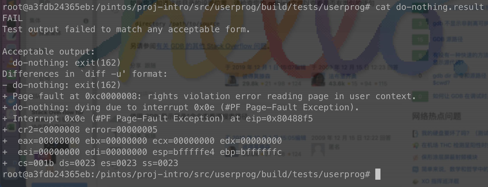

Proj0 intro
View the file proj-intro/src/userprog/build/tests/userprog/do-nothing.result. This file shows the output of the Pintos testing framework when running the do-nothing test. The testing framework expected Pintos to output do-nothing: exit(162). This is the standard message that Pintos prints when a process exits (you'll encounter this again in the System Calls section of the Project 1 spec). However, as shown in the diff, Pintos did not output this message; instead, the do-nothing program crashed in userspace due to a memory access violation (a segmentation fault). Based on the contents of the do-nothing.result le, please answer the following questions on Gradescope:

段地址：8086有20位地址线，使用基础地址（段地址*16）+偏移地址 = 物理地址寻址，寄存器组CS:IP分别保存段地址和偏移地址
将若干地址连续的内存单元看作一个段，可以在16位的cpu上实现20位的寻址空间，即1MB。
然而i386的寻址更复杂。有32位地址线和多种寻址模式。CS:EIP寄存器组中，CS为选择符，实际上是一个索引，用于在GDT中寻找基址，将基址与32位偏移地址相加得到物理地址。这是一种保护操作系统的方法。
（Reference：Windows usually sets up the selectors so that they map 1:1 directly to virtual addresses, that's why they all have base of 0. fs is the exception because it's used for quick addressing of the Thread Information Block (TIB) which is separate for each thread of each process. https://reverseengineering.stackexchange.com/questions/14397/how-are-addresses-calculated-from-the-values-in-x86-segment-registers）
所以在本题中，我倾向于认为cs=001b得到的基址应该也为0，所以第二题中造成程序崩溃的指令地址在0x080488f5

 1. What virtual address did the program try to access from userspace that caused it to crash? 
CR2是页故障线性地址寄存器，保存最后一次出现页故障的全32位线性地址;
cr2= 0xc0000008
2. What is the virtual address of the instruction that resulted in the crash? 
EIP寄存器均为指令存储器，用来存储CPU要读取指令的地址
eip = 0x080488f5

3. To investigate, disassemble the do-nothing binary using objdump (you used this tool in Homework 0). What is the name of the function the program was in when it crashed? Copy the disassembled code for that function onto Gradescope, and identify the instruction at which the program crashed. 
(Use i386-elf-objdump instead of objdump)

There’s the asm generate by “i386-elf-objdump -d do-nothing”

Find the instruction at 0x080488f5 :
80488f5:	8b 45 0c             	mov    0xc(%ebp),%eax
In function _start:
080488ef <_start>:
 80488ef:	55                   	push   %ebp /*push ebp , to follow System V Application Binary Interface*/
 80488f0:	89 e5                	mov    %esp,%ebp /*save current stack pointer */
 80488f2:	83 ec 18             	sub    $0x18,%esp  /*allocate 0x18 bytes(24D Bytes on stack)*/
 80488f5:	8b 45 0c             	mov    0xc(%ebp),%eax /*mov the (%ebp + 12) to %eax ,and then programme crash because of “rights violation error reading page in user context.” */
 80488f8:	89 44 24 04          	mov    %eax,0x4(%esp) 
 80488fc:	8b 45 08             	mov    0x8(%ebp),%eax
 80488ff:	89 04 24             	mov    %eax,(%esp)
 8048902:	e8 6d f7 ff ff       	call   8048074 <main>
 8048907:	89 04 24             	mov    %eax,(%esp)
 804890a:	e8 d4 22 00 00       	call   804abe3 <exit>

4. Find the C code for the function you identied above (hint: it was executed in userspace, so it's either in do-nothing.c or one of the files in proj-intro/src/lib or proj-intro/src/lib/user), and copy it onto Gradescope. For each instruction in the disassembled function in #3, explain in a few words why it's necessary and/or what it's trying to do. Hint: see 80x86 Calling Convention.

function in src/lib/user/entry.c
#include <syscall.h>

int main(int, char* []);
void _start(int argc, char* argv[]);

void _start(int argc, char* argv[]) { exit(main(argc, argv)); }

 5. Why did the instruction you identied in #3 try to access memory at the virtual address you identied in #1? Don't explain this in terms of the values of registers; we're looking for a higherlevel explanation.
_start 的调用者时内核程序intr_exit,而如果_start被用户程序调用不会出现问题；但_start在读取参数时试图从内核栈上读取参数，程序由于protection violation而结束

6. Step into the process_execute function. What is the name and address of the thread running this function? What other threads are present in Pintos at this time? Copy their struct threads. (Hint: for the last part dumplist &all_list thread allelem may be useful.)

Running: main 0xc000e000
Bolcked:idle	0xc0104000
Ready:do_nothing 0xc010b000
pintos-debug: dumplist #0: 0xc000e000 {tid = 1, status = THREAD_RUNNING,
  name = "main", '\000' <repeats 11 times>, stack = 0xc000edbc "\374\355", priority = 31, allelem = {
    prev = 0xc0035a1c <all_list>, next = 0xc0104020}, elem = {prev = 0xc0035a0c <ready_list>,
    next = 0xc0035a14 <ready_list+8>}, pcb = 0xc010500c, magic = 3446325067}
pintos-debug: dumplist #1: 0xc0104000 {tid = 2, status = THREAD_BLOCKED,
  name = "idle", '\000' <repeats 11 times>, stack = 0xc0104f14 "", priority = 0, allelem = {
    prev = 0xc000e020, next = 0xc010b020}, elem = {prev = 0xc0035a0c <ready_list>,
    next = 0xc0035a14 <ready_list+8>}, pcb = 0x0, magic = 3446325067}
(gdb) backtrace idle
#0  process_execute (file_name=0xc0007d50 "do-nothing") at ../../userprog/process.c:65
#1  0xc0020891 in run_task (argv=0xc003590c <argv+12>) at ../../threads/init.c:279
#2  0xc0020a0d in run_actions (argv=0xc003590c <argv+12>) at ../../threads/init.c:352
#3  0xc00203e1 in main () at ../../threads/init.c:138

pintos-debug: dumplist #2: 0xc010b000 {tid = 3, status = THREAD_READY,
  name = "do-nothing\000\000\000\000\000", stack = 0xc010bfd4 "", priority = 31, allelem = {
    prev = 0xc0104020, next = 0xc0035a24 <all_list+8>}, elem = {prev = 0xc0035a0c <ready_list>,
    next = 0xc0035a14 <ready_list+8>}, pcb = 0x0, magic = 3446325067}

 7. What is the backtrace for the current thread? Copy the backtrace from GDB as your answer and also copy down the line of C code corresponding to each function call.

Backtrace
(gdb) backtrace "do-nothing"
#0  process_execute (file_name=0xc0007d50 "do-nothing") at ../../userprog/process.c:64
C:tid = thread_create(file_name, PRI_DEFAULT, start_process, fn_copy);
#1  0xc0020891 in run_task (argv=0xc003590c <argv+12>) at ../../threads/init.c:279	process_wait(process_execute(task));
#2  0xc0020a0d in run_actions (argv=0xc003590c <argv+12>) at ../../threads/init.c:352 
C:a->function(argv);
#3  0xc00203e1 in main () at ../../threads/init.c:138	
C:run_actions(argv);

8. Set a breakpoint at start_process and continue to that point. What is the name and address of the thread running this function? What other threads are present in Pintos at this time? Copy their struct threads. 

Running:do_nothing 0xc010b000
Bolcked:
main 0xc000e000
idle	0xc0104000

9. Where is the thread running start_process created? Copy down this line of code. 
#0  process_execute (file_name=0xc0007d50 "do-nothing") at ../../userprog/process.c:64
C:tid = thread_create(file_name, PRI_DEFAULT, start_process, fn_copy);

10. Step through the start_process() function until you have stepped over the call to load(). Note that load() sets the eip and esp fields in the if_ structure. Print out the value of the if_ structure, displaying the values in hex (hint: print/x if_).

(gdb) p/s if_
$2 = {edi = 0, esi = 0, ebp = 0, esp_dummy = 0, ebx = 0, edx = 0, ecx = 0, eax = 0, gs = 35, fs = 35,
  es = 35, ds = 35, vec_no = 0, error_code = 0, frame_pointer = 0x0, eip = 0x80488ef, cs = 27,
  eflags = 514, esp = 0xc0000000, ss = 35}


/*A bug only happened once, ignore it 
in load(){}
if (file_read(file, &ehdr, sizeof ehdr) != sizeof ehdr ||
      memcmp(ehdr.e_ident, "\177ELF\1\1\1", 7) || ehdr.e_type != 2 || ehdr.e_machine != 3 ||
      ehdr.e_version != 1 || ehdr.e_phentsize != sizeof(struct Elf32_Phdr) || ehdr.e_phnum > 1024) {
    printf("load: %s: error loading executable\n", file_name);
    goto done;
  }


*/

11. The first instruction in the asm volatile statement sets the stack pointer to the bottom of the if_ structure. The second one jumps to intr_exit. The comments in the code explain what's happening here. Step into the asm volatile statement, and then step through the instructions. As you step through the iret instruction, observe that the function returns into userspace. Why does the processor switch modes when executing this function? Feel free to explain this in terms of the values in memory and/or registers at the time iret is executed, and the functionality of the iret instruction. 
	Before starting an userprog, OS run the kernel prog first and create a thread for userprog, then switch to userprog through an interrupt handle. 
	Kernel use an interrupt frame to pass the args of userprog and 
12. Once you've executed iret, type info registers to print out the contents of registers. Include the output of this command on Gradescope. How do these values compare to those when you printed out if_? 
	same

13. Notice that if you try to get your current location with backtrace you'll only get a hex address. This is because because the debugger only loads in the symbols from the kernel. Now that we are in userspace, we have to load in the symbols from the Pintos executable we are running, namely do-nothing. To do this, use loadusersymbols tests/userprog/do-nothing. Now, using backtrace, you'll see that you're currently in the _start function. Using the disassemble and stepi commands, step through userspace instruction by instruction until the page fault occurs. At this point, the processor has immediately entered kernel mode to handle the page fault, so backtrace will show the current stack in kernel mode, not the user stack at the time of the page fault. However, you can use btpagefault to nd the user stack at the time of the page fault. Copy down the output of btpagefault.

#0  _start (argc=-268370093, argv=0xf000ff53) at ../../lib/user/entry.c:6
#1  0xf000ff53 in ?? ()

14.Modify the Pintos kernel so that do-nothing no longer crashes. Your change should be in the Pintos kernel, not the userspace program (do-nothing.c) or libraries in proj-intro/src/lib. This should not involve extensive changes to the Pintos source code. Our sta solution solves this with a single-line change to process.c. Explain the change you made to Pintos and why it was necessary. After making this change, the do-nothing test should pass but all others will still fail.

%esp = 0xc0000000 when iret to _start;
080488ef <_start>:
 80488ef:	55                   	push   %ebp	/*now %esp is 0xbffffffc, push ebp to save the return address*/
 80488f0:	89 e5                	mov    %esp,%ebp	/*now %ebp is 0xbffffffc too*/
 80488f2:	83 ec 18             	sub    $0x18,%esp	/*stack align*/
 80488f5:	8b 45 0c             	mov    0xc(%ebp),%eax/*Try to access 0xc0000008, which is kernel stack, crash*/
 80488f8:	89 44 24 04          	mov    %eax,0x4(%esp)
 80488fc:	8b 45 08             	mov    0x8(%ebp),%eax

so we can make if_.esp less than 0xeffffff4，to avoid protection violation

15. It is possible that your x also works for the stack-align-0 test, but there are solutions for do-nothing that do not. Take a look at the stack-align-0 test. It behaves similarly to do-nothing, but it returns the value of esp % 16. Write down what this program should return (hint: this can be found in stack-align-0.ck) as well as why this is the case. You may wish to review stack alignment from Section 02 .) Then make sure that your previous x for do-nothing also passes stack-align-0. 

to follow System V ABI, we need stack align, esp%16 ==8(or 12, because push %ebp takes 4 bytes)
/*if_.esp is 0xc0000000now*/
    /*we need if_.esp sub an offset to avoid protection violation. 
    The offset should equal or greater than 12,
    so that 0xc(%ebp) won't touch kernel stack. 
    Don't forget stack align, (offset+28)%16 should equal 12,
    so the smallest offset is 20 */
    if_.esp = if_.esp-20;

16. Re-run GDB as before. Execute the loadusersymbols tests/userprog/do-nothing command, set a breakpoint at _start, and continue, to skip directly to the beginning of userspace execution. Using the disassemble and stepi commands, execute the do-nothing program instruction by instruction until you reach the int $0x30 instruction in proj-intro/src/lib/user/syscall.c. At this point, print the top two words at the top of the stack by examining memory (hint: x/2xw $esp) and copy the output. 

(gdb) x/2xw $esp
0xbfffff98:	0x00000001	 x000000a2
syscall1(SYS_EXIT, status);

17. The int $0x30 instruction switches to kernel mode and pushes an interrupt stack frame onto the kernel stack for this process. Continue stepping through instruction-by-instruction until you reach syscall_handler. What are the values of args[0] and args[1], and how do they relate to your answer to the previous question?

args[0] is 1, args[1] is 162;
as same as answers in 16.
that means userprog return will call a sys call and pass flag and return value.
In this case is 1, 162.

proj0-intro is Finshed.

